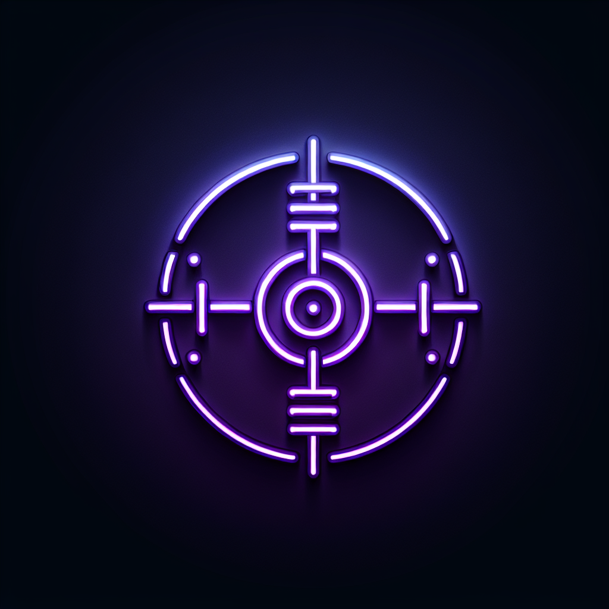

# Chronos Vault: The Ultimate Multi-Chain Digital Vault Platform



## Overview

Chronos Vault is a revolutionary decentralized platform for creating tamper-proof digital time vaults using advanced blockchain technologies and cross-chain security. The platform enables users to securely store, manage, and time-lock digital assets with military-grade security, zero-knowledge privacy, and cross-chain validation across 22 specialized vault types.

## Key Features

### 22 Specialized Vault Types

Chronos Vault offers an unparalleled selection of purpose-built vaults for every security need:

- **Time Lock Vault**: Schedule asset releases with precise timing controls
- **Multi-Signature Vault**: Require multiple approvals for enhanced security
- **Geo-Location Vault**: Add physical presence requirements for vault access
- **Quantum-Resistant Vault**: Future-proof protection against quantum computing threats
- **Cross-Chain Fragment Vault**: Distribute assets across multiple blockchains for superior security
- **NFT-Powered Vault**: Tokenized access control through digital collectibles
- **Biometric Vault**: Advanced identity verification through biometric factors
- **Sovereign Fortress Vault™**: Our ultimate all-in-one security solution
- **14 additional specialized vault types** for every security need

### Triple-Chain Security Architecture

Chronos Vault utilizes a revolutionary Triple-Chain Security model to provide unprecedented protection for digital assets:

- **Ethereum Layer**: Primary blockchain for ownership records and access control
- **Solana Layer**: High-frequency monitoring and rapid validation
- **TON Layer**: Backup security system and emergency recovery operations

This multi-chain approach ensures that assets are secured by three independent blockchain networks, preventing single points of failure and significantly enhancing security over traditional single-blockchain solutions.

### Quantum-Resistant Encryption

Our platform implements the latest post-quantum cryptographic standards:

- CRYSTALS-Kyber for key encapsulation
- CRYSTALS-Dilithium for digital signatures
- Hybrid security model combining quantum-resistant algorithms with traditional cryptography
- Fully implemented zero-knowledge proof infrastructure

### Triple-Chain Decentralized Storage

Assets are securely distributed across multiple decentralized storage networks:

- **Arweave**: Permanent, immutable storage layer
- **IPFS**: Content-addressed distributed file system
- **Filecoin**: Incentivized storage with cryptographic proofs

All storage is protected with quantum-resistant encryption and cross-chain verification.

### Zero-Knowledge Privacy Shield

Our advanced ZK infrastructure provides:

- Verify vault status without revealing contents
- Generate selective disclosures and range proofs
- Maintain complete privacy while proving ownership
- Implement cross-chain zero-knowledge verification

### Universal Chain Interoperability

Chronos Vault's architecture supports seamless integration with multiple blockchains through:

- Native support for TON, Ethereum, Solana, and Bitcoin
- Standardized vault interfaces for cross-chain operation
- Secure lock-and-mint bridge mechanisms
- Atomic cross-chain transactions with rollback protection

### AI-Enhanced Security Monitoring

Our platform incorporates advanced AI security systems for:

- Real-time monitoring of vault activities across all chains
- Behavioral analysis and anomaly detection
- Predictive security measures with proactive threat mitigation
- Automated incident response with security team notifications

## ChronosToken (CVT)

ChronosToken (CVT) introduces a revolutionary deflationary token model optimized for long-term value preservation through a novel time-based release and automated burning mechanism.

### Token Economics

- **Total Supply**: 21,000,000 CVT (fixed maximum)
- **Distribution Period**: 21 years with progressive halving
- **Mechanism**: Deflationary model with continuous burning
- **Cross-Chain Implementation**: Primary on TON with wrapped versions on ETH/SOL

### Token Utility

CVT serves essential functions within the Chronos Vault ecosystem:

1. **Platform Fee Payment**: Native token for all platform services with reduced fees for token holders
2. **Security Staking**: Required for high-value vault access and enhanced security features
3. **Feature Access**: Premium features require token holdings
4. **Governance Rights**: Proportional voting weight in platform decisions
5. **Validator Requirements**: Security validation roles require token stakes

## Technical Implementation

Chronos Vault is built with a cutting-edge tech stack featuring:

- **Frontend**: React.js with TypeScript, Tailwind CSS, shadcn/ui components
- **Backend**: Express.js with TypeScript, PostgreSQL database
- **Blockchain**: Ethereum Layer 2 (Arbitrum), Solana, TON
- **Smart Contracts**: Solidity (Ethereum/Arbitrum), Rust (Solana), FunC (TON)
- **Security**: Zero-knowledge proofs, quantum-resistant cryptography
- **UI/UX**: Framer Motion animations, Three.js 3D visualizations
- **State Management**: TanStack Query (React Query v5)
- **Wallet Integration**: MetaMask, Phantom, TON Keeper

### Trinity Protocol Architecture

Our platform implements the Trinity Protocol with 2-of-3 consensus across three blockchains:

- **Ethereum Layer 2 (Arbitrum)**: Primary security layer (95% lower fees than L1)
- **Solana**: Rapid validation and high-frequency monitoring
- **TON**: Quantum-resistant backup and emergency recovery

## Getting Started

### Prerequisites

- Node.js 18+ and npm
- PostgreSQL database
- MetaMask wallet (for Ethereum/Arbitrum)
- Phantom wallet (for Solana, optional)
- TON Keeper wallet (for TON, optional)

### Installation

1. **Clone the repository**
```bash
git clone https://github.com/Chronos-Vault/chronos-vault-platform.git
cd chronos-vault-platform
```

2. **Install dependencies**
```bash
npm install
```

3. **Set up environment variables**
```bash
cp .env.example .env
# Edit .env with your configuration
```

Required environment variables:
- `DATABASE_URL`: PostgreSQL connection string
- `ETHEREUM_RPC_URL`: Arbitrum Sepolia RPC (default: https://sepolia-rollup.arbitrum.io/rpc)
- `ETHEREUM_CHAIN_ID`: 421614 (Arbitrum Sepolia)
- `JWT_SECRET`: Your secret key for authentication
- `PRIVATE_KEY`: Your wallet private key (testnet only)

4. **Set up the database**
```bash
npm run db:push
```

5. **Start the development server**
```bash
npm run dev
```

The application will be available at `http://localhost:5000`

### Deployed Contracts (Arbitrum Sepolia Testnet)

The Trinity Protocol smart contracts are deployed on Arbitrum Sepolia:

- **CVT Token**: `0xFb419D8E32c14F774279a4dEEf330dc893257147`
- **CVT Bridge**: `0x21De95EbA01E31173Efe1b9c4D57E58bb840bA86`
- **ChronosVault**: `0x99444B0B1d6F7b21e9234229a2AC2bC0150B9d91`
- **CrossChainBridge**: `0x13dc7df46c2e87E8B2010A28F13404580158Ed9A`
- **Test USDC**: `0x6818bbb8f604b4c0b52320f633C1E5BF2c5b07bd`

View on Arbiscan: https://sepolia.arbiscan.io

### Testing

Run the test suite:
```bash
npm test
```

Run smart contract tests:
```bash
npx hardhat test
```

### Building for Production

```bash
npm run build
```

## Security Testing & Verification

The platform includes comprehensive security verification tools:

- **Contract Verification Tool**: Verify the integrity of deployed smart contracts
- **Triple-Chain Security Dashboard**: Monitor security status across all blockchains
- **Transaction Monitoring**: Track all vault-related transactions in real-time
- **Cross-Chain Fee Monitor**: Optimize transactions across different networks
- **Zero-Knowledge Privacy Demo**: Interactive demonstration of our ZK technology

## Educational Resources

Chronos Vault is committed to blockchain education:

- **Vault School Hub**: Comprehensive learning portal for vault technologies
- **Interactive Tutorials**: Step-by-step guides for all security features
- **Technical Documentation**: In-depth explanations of security protocols
- **Security Whitepaper**: Detailed exploration of our security architecture

## Documentation

For more detailed information, please refer to:

- [ChronosToken Whitepaper](./CVT_WHITEPAPER.md)
- [Security Architecture](./SECURITY_ARCHITECTURE.md)
- [Technical Documentation](./TECHNICAL_README.md)
- [Deployment Guide](./DEPLOYMENT_GUIDE.md)

## Contributing

We welcome contributions from the community! Please see our [Contributing Guidelines](./CONTRIBUTING.md) for details.

### Open Source Vision

Chronos Vault is an open-source project committed to advancing blockchain security. We believe in:
- Mathematical security over trust assumptions
- Transparent, auditable code
- Community-driven development
- Enterprise-ready implementation

## License

This project is licensed under the MIT License - see the [LICENSE](./LICENSE) file for details.

Copyright (c) 2025 Chronos Vault

## Contact

For inquiries about the Chronos Vault platform, please contact us at chronosvault@chronosvault.org.
